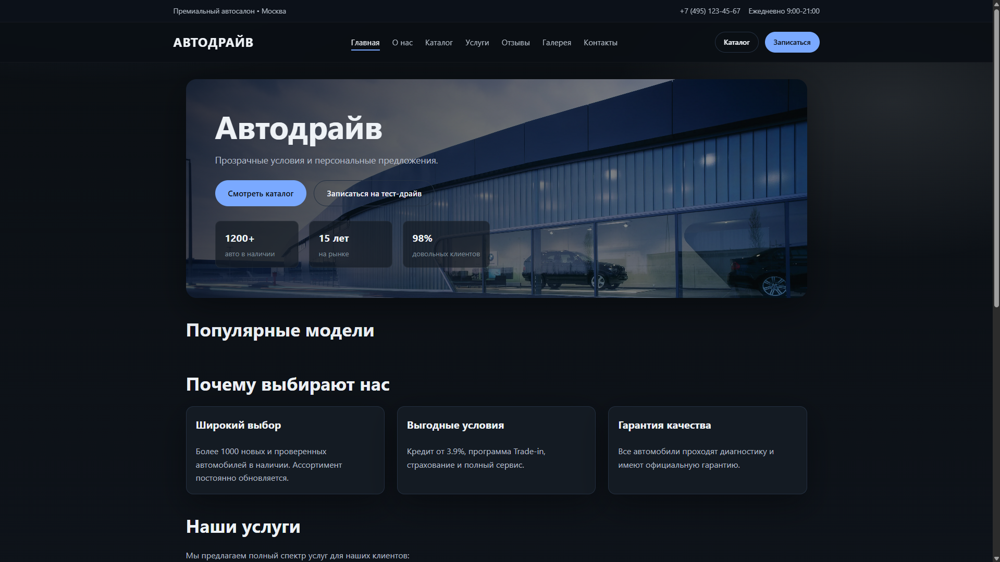
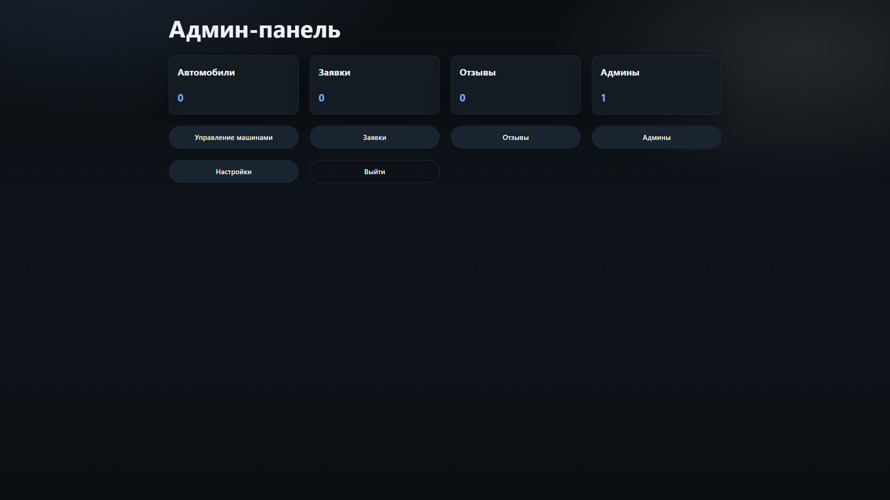

# Автосалон CMS (PHP + MySQL)

## Screenshots

| Homepage | Admin Panel |
|--------|-------------|
|  |  |

Проект: production-ready CMS для автосалона (PHP 8.x, MySQL 8.x). Дизайн, CSS и JS сохранены. Админ-панель, CRUD автомобилей и админов, заявки, отзывы, загрузка изображений.

> **Примечание:** Проект выполнен как студенческая работа. Репозиторий будет поддерживаться и обновляться. Любой желающий может использовать проект как основу для своих задач. Лицензия не устанавливается.

## Возможности
- CRUD автомобилей (добавление, редактирование, удаление, фото)
- CRUD админов
- Заявки (лиды): просмотр, удаление, пометка «просмотрено»
- Отзывы: модерация и публикация
- Настройки сайта: название сайта (меняется во всех местах)
- ЧПУ для карточек авто (`/car/slug`)

## Стек
- PHP 8.x
- MySQL 8.x
- Apache (mod_rewrite)

## Установка (Beget / любой хостинг)
1. **Залейте содержимое папки `public_html`** в корень сайта на хостинге.
2. Создайте БД MySQL и пользователя.
3. Импортируйте файл `database.sql` в phpMyAdmin.
4. Настройте подключение в `public_html/includes/db.php`:
   - `DB_HOST`, `DB_NAME`, `DB_USER`, `DB_PASS`
5. Права на папки:
   - `public_html/uploads` -> 755/775
   - `public_html/sessions` -> 755/775

## Создание первого администратора
Откройте в браузере:
```
https://ВАШ_ДОМЕН/admin/install_admin.php
```
Заполните email. После создания админа файл **удаляется автоматически**.

После этого вход:
```
https://ВАШ_ДОМЕН/admin/login.php
```

## Настройки сайта
Изменение названия сайта:
```
/admin/settings.php
```
Название обновится в шапке, футере и мета-тегах.

## Структура
```
/public_html
  /admin
  /assets
  /includes
  /templates
  /uploads
  index.php
  catalog.php
  car.php
  contacts.php
  reviews.php
  gallery.php
  services-*.php
```

## Важно
- `uploads/` и `sessions/` не хранятся в git (см. `.gitignore`).
- Для ЧПУ необходим `.htaccess` и включенный `mod_rewrite`.

---

# Car Dealership CMS (PHP + MySQL)

## Screenshots

| Homepage | Admin Panel |
|--------|-------------|
|  |  |

Production-ready CMS for a car dealership (PHP 8.x, MySQL 8.x). Layout, CSS, and JS preserved. Admin panel, cars/admins CRUD, leads, reviews, image upload.

> **Note:** This project was completed as a student work. The repository will be maintained and updated. Anyone may use it as a foundation for their own projects. No license is provided.

## Features
- Cars CRUD (create/edit/delete, image upload)
- Admins CRUD
- Leads: view/delete, mark as viewed
- Reviews: moderation and publish
- Site settings: site name (updated everywhere)
- SEO-friendly car pages (`/car/slug`)

## Stack
- PHP 8.x
- MySQL 8.x
- Apache (mod_rewrite)

## Installation (Beget / any hosting)
1. **Upload `public_html` contents** to your hosting web root.
2. Create MySQL database and user.
3. Import `database.sql` via phpMyAdmin.
4. Configure DB in `public_html/includes/db.php`:
   - `DB_HOST`, `DB_NAME`, `DB_USER`, `DB_PASS`
5. Folder permissions:
   - `public_html/uploads` -> 755/775
   - `public_html/sessions` -> 755/775

## Create the first admin
Open in browser:
```
https://YOUR_DOMAIN/admin/install_admin.php
```
Enter email. The file **self-deletes** after creating the admin.

Login:
```
https://YOUR_DOMAIN/admin/login.php
```

## Site settings
Change site name here:
```
/admin/settings.php
```
The name updates in header, footer, and meta tags.

## Structure
```
/public_html
  /admin
  /assets
  /includes
  /templates
  /uploads
  index.php
  catalog.php
  car.php
  contacts.php
  reviews.php
  gallery.php
  services-*.php
```

## Notes
- `uploads/` and `sessions/` are git-ignored (see `.gitignore`).
- SEO URLs require `.htaccess` and `mod_rewrite` enabled.